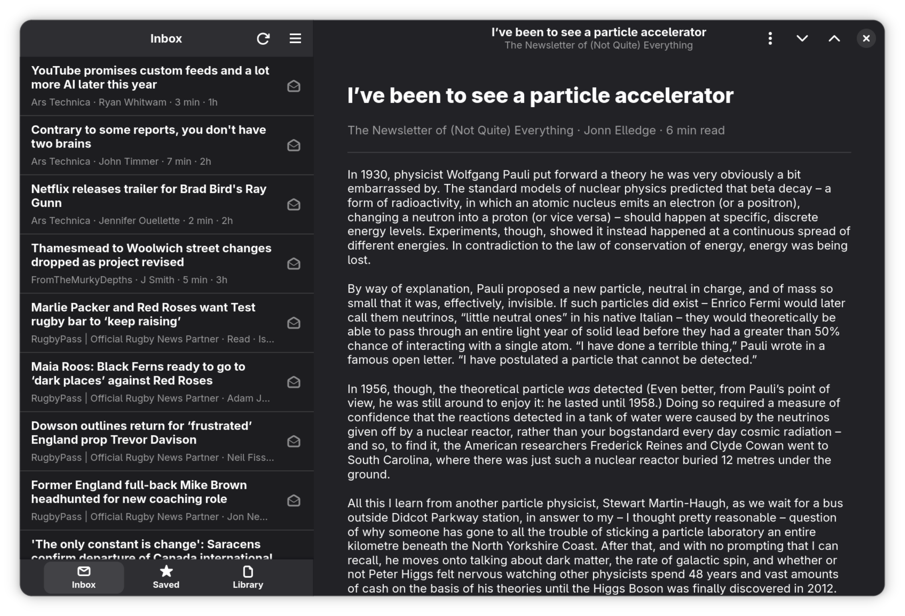

# Brooklet

Brooklet is an opinionated, offline-first Miniflux client for GNOME. It helps
you get through what is new, keep what matters, and read comfortably in a
native GTK interface.

There is also a separately developed Android application with the same vibe,
but a totally different implementation. I hope you enjoy either, neither or
both.



## Development status

The GNOME 51 application now includes setup, incremental offline-first sync,
Inbox, Saved, Library, native reading, local search, and optional Karakeep
delivery. The repository and sync contracts have automated coverage; the next
release gate is live-server use and visual/accessibility refinement.

While the window is active, Brooklet automatically syncs about every five
minutes and catches up after a long suspend or time away. Automatic sync pauses
on connections reported as metered or unavailable, and slows down after failures.
You can still refresh manually at any time.

Read/unread, star, and Karakeep actions are saved locally immediately and sent
after two quiet seconds, with a ten-second limit during continuous activity.
Delivery continues while the window is inactive and on metered connections.
Retryable failures use exponential delays from five seconds to thirty minutes;
credentials or certificate failures retry at thirty-minute intervals. Changes
survive closing the app and resume delivery on the next launch. Brooklet does
not run an upload service after it exits.

A failed outgoing delivery does not block incoming article updates. Unsent
read/star changes stay queued and protected from remote state; Karakeep outages
also leave delivery queued. Sync diagnostics retain delivery failures even when
article refresh succeeds. Local storage errors still stop sync.

To replace a rejected or missing Miniflux token, open Preferences → Reconnect
account. Brooklet checks the token for the connected server and username, keeps
cached articles and pending work, and retries sync after reconnecting.

The canonical build is the Flatpak manifest at
`flatpak/com.nedrichards.brooklet.Devel.json`. It targets GNOME 51 and is placed
where GNOME Builder discovers it from a fresh checkout.

For the complete keyboard system and regression checks, see
[Keyboard shortcuts](docs/keyboard-shortcuts.md).

## Native build

```sh
meson setup build
meson compile -C build
meson test -C build
```

Native development requires GTK 4.24, libadwaita 1.10, Blueprint Compiler,
Meson, Cargo, and Rust 1.93 or later but Flatpak is the only supported or
encouraged environment.

## Core tests without GTK

The non-UI domain and service code deliberately builds without GTK:

```sh
cargo test --all-targets
cargo fmt --check
cargo clippy --all-targets -- -D warnings
```

Setup logic is tested without credentials or a live service through injected
validator, repository, and secret-store implementations. The Flatpak smoke
test also constructs the main window, setup dialog, and shortcuts dialog:

```sh
flatpak-builder --run build-dir \
  flatpak/com.nedrichards.brooklet.Devel.json \
  brooklet --smoke-test
```

## Licence

Brooklet is licensed under GPL-3.0-or-later. See `COPYING`.

For private cache audits and native rendering previews, see
[Reader testing](docs/reader-testing.md).

Dependency checks, CI artifacts, and release packaging are described in
[Maintenance](docs/maintenance.md).
